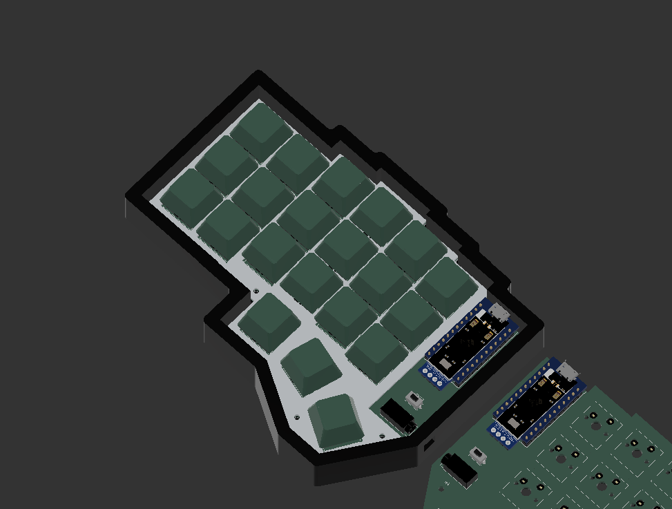
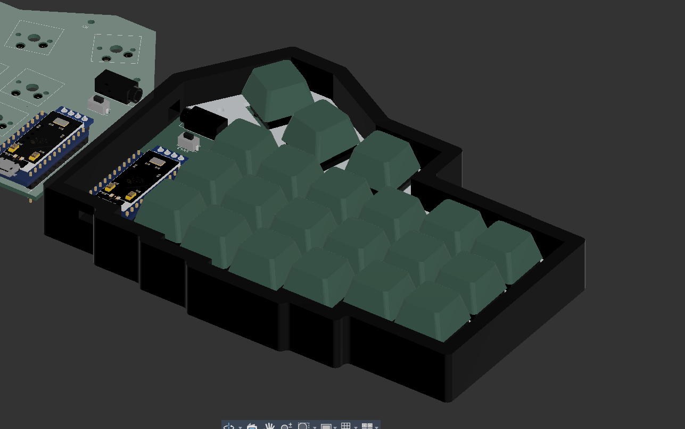
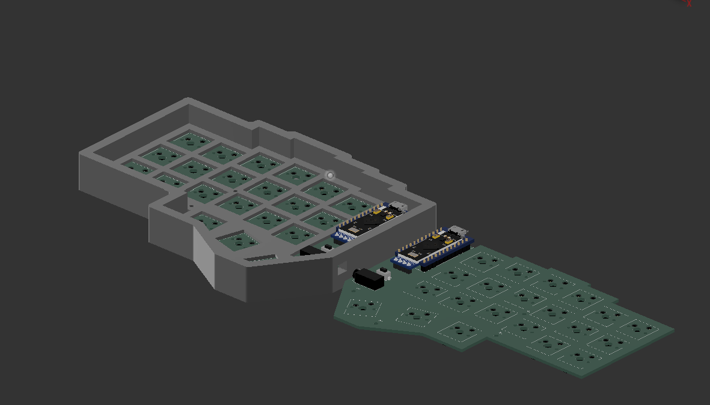
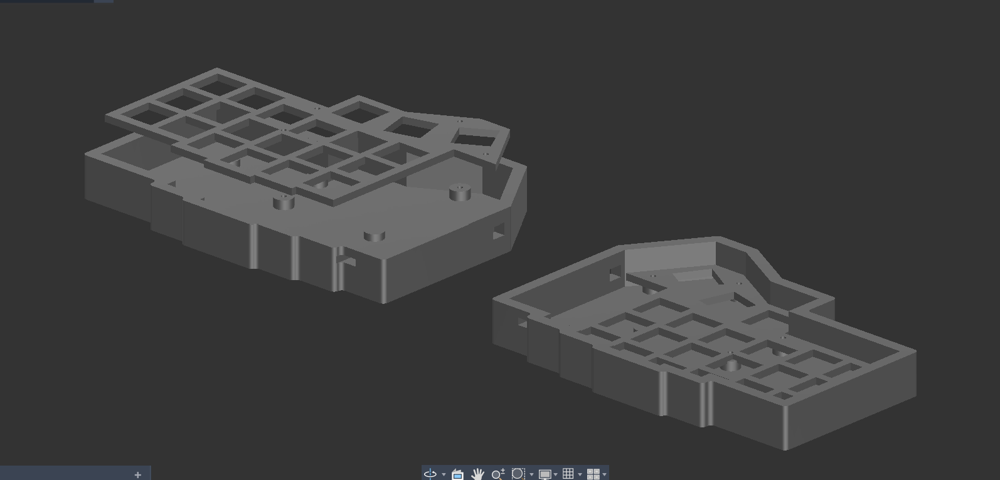
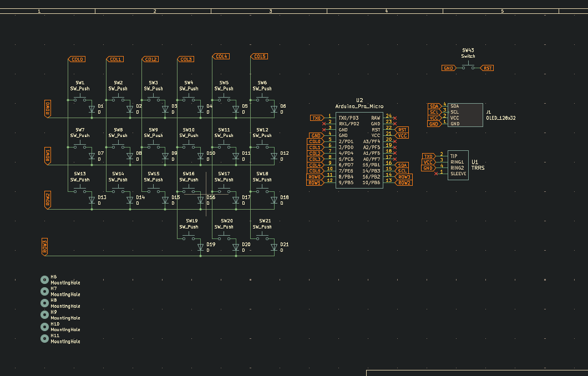
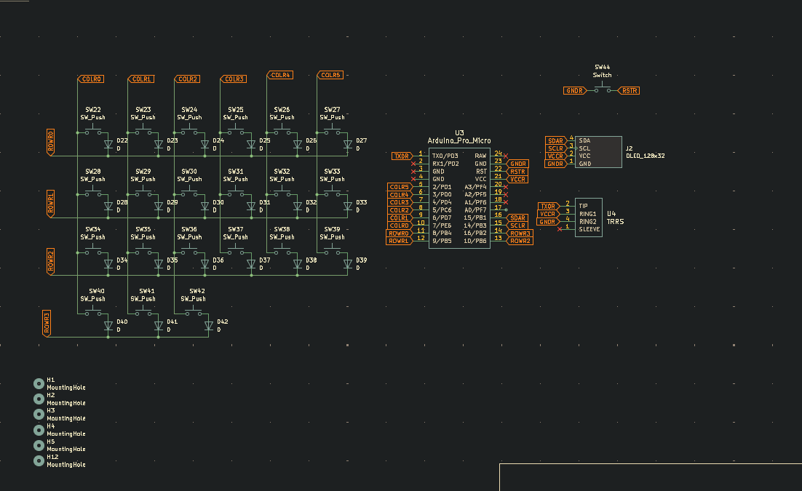
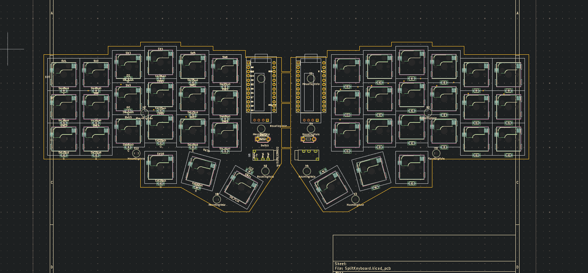
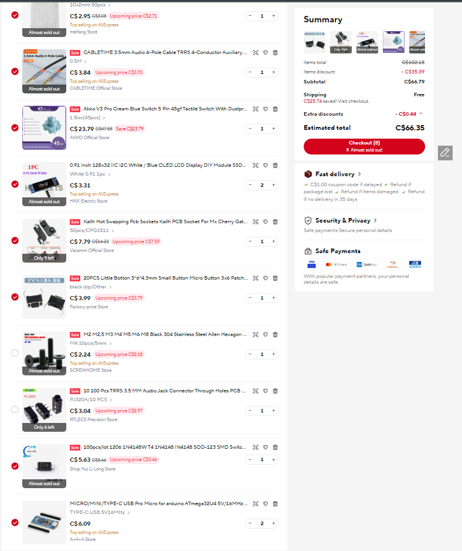
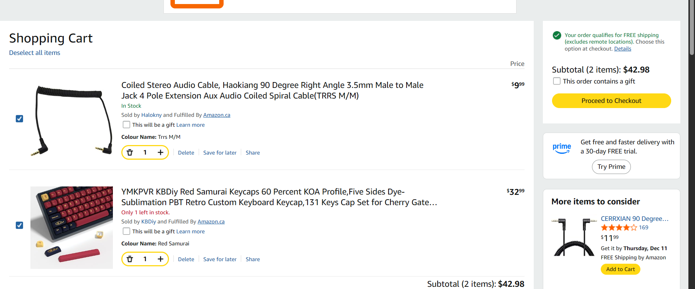
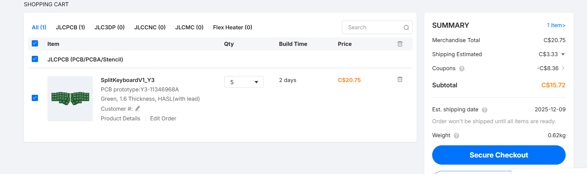

# Split keyboarddd

## WHY THO??

Weeeeell my wrists kinda hurt all of a sudde, so this is such a good opportunity to learn about keyboard developemt including creating a pcb, 3d modeling and budgeting a keyboard.

This project has been so much fun, although it was a pin at the beginnig, once I  got the hang off it, oufff boy, I was so much better

This keyboard is heavily inspired by a corne keyboard, specially the key layout

# IMAGESSS!!!

### render

 
 

###  case

 
 

###  schematics

 
 

###  pcb layout

 

###  BOM images

 
 
 

## Disclaimer (The currency for this purchases is Canadian Dollars)

